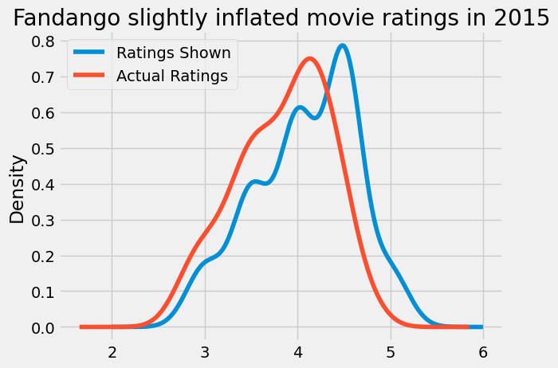

# Inflation in Fandango Movie Ratings

This investigation shows that [Fandango](https://fandango.com), one of the largest sellers of movie theater tickets in the United States, was showing inflated ratings of movies anywhere from 0.3 to 0.5 stars (on a 5-star scale). For example, a movie that was given a rating of 4.1 stars by users could be rounded up to 4.5 stars.

An additional analysis shows that Fandango seemed to have fixed their ratings for subsequent movies released in 2016-2017.

[**See the analysis here**](Fandango_Movie_Rating_Inflation.ipynb) (Jupyter Notebook on GitHub)

### Tools
* Python 3
* Jupyter
* Kaggle

### Data
* [FiveThirtyEight Fandango Movie Ratings 2015](https://www.kaggle.com/datasets/fivethirtyeight/fivethirtyeight-fandango-dataset)
* [DataQuest Fandango Movie Ratings 2016-2017](https://www.kaggle.com/datasets/rislam4/movies-rating-in-20162017)